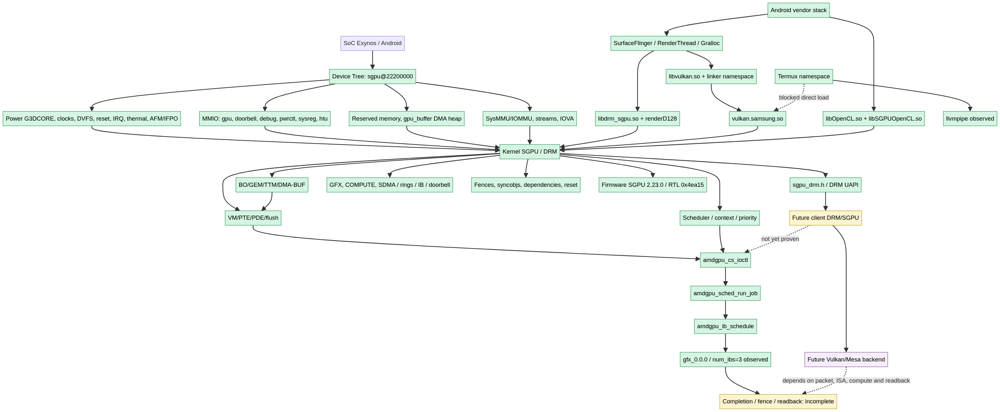

# Mapa completo da Xclipse 940

**Projeto interno:** XO940  
**Hardware:** Samsung Xclipse 940 no SM-S721B / s5e9945 / erd9945  
**Status:** documento de estudo baseado em evidências; não é prova de driver independente



> Este documento funde o mapa visual, o mapa técnico e os pontos de entrada para uma futura camada de driver. A imagem mostra as conexões principais; as seções seguintes explicam o que foi observado, o que é parcial e o que ainda é hipótese.

## 1. Finalidade do mapa

O mapa descreve a infraestrutura necessária para estudar a Xclipse 940 de baixo para cima: Device Tree e plataforma, kernel SGPU/DRM, memória e IOMMU, firmware, scheduler, rings, Android, bibliotecas vendor e possíveis clientes independentes.

A finalidade não é declarar compatibilidade automática com RADV, Turnip ou AMDGPU. A finalidade é localizar os contratos que precisariam ser compreendidos antes de qualquer port de driver.

## 2. Visão estrutural

```text
SoC Exynos / Android
└── Xclipse 940 / bloco G3D
    ├── Device Tree e plataforma
    │   ├── sgpu@22200000
    │   ├── MMIO, IRQ, power-domain, clocks, DVFS e thermal
    │   ├── reset, AFM/IFPO e memória reservada
    │   └── SysMMU/IOMMU e DMA heap
    ├── Kernel SGPU / DRM
    │   ├── sgpu_drm.h / UAPI
    │   ├── GEM/BO/TTM/DMA-BUF
    │   ├── VM/PTE/PDE/IOMMU
    │   ├── scheduler, context e prioridade
    │   ├── GFX / COMPUTE / SDMA
    │   ├── rings / IBs / doorbells
    │   ├── fences / syncobjs / recovery
    │   └── firmware
    ├── Android vendor
    │   ├── libdrm_sgpu.so
    │   ├── vulkan.samsung.so
    │   ├── libOpenCL.so / libSGPUOpenCL.so
    │   ├── SurfaceFlinger / RenderThread / Gralloc
    │   └── linker namespaces / SELinux / HAL
    └── possível cliente independente
        ├── cliente DRM/SGPU mínimo
        ├── compute experimental
        └── backend Vulkan/Mesa experimental
```

## 3. Device Tree e plataforma

O nó observado é `/sys/firmware/devicetree/base/sgpu@22200000`, com `compatible = samsung-sgpu,samsung-sgpu`. Foram observados filhos e regiões relacionados a `gpu_pm`, `gpu_doorbell`, `gpu_debug`, `gpu_smntarg`, `gpu_sysreg`, `gpu`, `doorbell`, `debug`, `pwrctl`, `sysreg` e `htu`.

As interrupções observadas são `SGPU` e `GPU-AFM`. O nó referencia o domínio `pd_g3dcore`; também aparecem DVFS, IFPO, thermal G3D, `sgpu_rmem`, `gpu_buffer_dma_heap`, grupos SysMMU/IOMMU e BTS G3D.

A Device Tree informa recursos e relações de plataforma. Ela não define sozinha o formato dos comandos, a ABI de user space, a ISA ou a semântica completa dos registradores.

## 4. Identidade observada

| Campo | Valor | Classificação |
| --- | --- | --- |
| Dispositivo | SM-S721B / r12s | Confirmado nos logs |
| Plataforma | erd9945 / s5e9945 | Confirmado nos logs e fonte |
| GPU | Xclipse 940 / família MGFX 147 | Confirmado na captura |
| Device ID | `0x000073a0` | Confirmado na captura |
| Chip revision | `0x02600200` | Confirmado na captura |
| GFX IP | 10.0 / ring mask `0xf` | Confirmado na captura |
| COMPUTE IP | 10.0 / mask `0x7` | Identidade observada; execução independente não demonstrada |
| Firmware SGPU | `2.23.0` | Confirmado na captura |
| RTL | `0x0004ea15` | Confirmado na captura |

## 5. Kernel SGPU, DRM e UAPI

Caminhos de maior valor no código Samsung inventariado:

```text
kernel/include/uapi/drm/sgpu_drm.h
kernel/drivers/gpu/drm/samsung/gpu/sgpu/
  amdgpu_drv.c       # match, identidade e inicialização
  amdgpu_cs.c        # command submission
  amdgpu_vm.c        # VM/PTE/PDE/flush
  amdgpu_gem.c       # objetos e BO
  amdgpu_object.c    # memória
  amdgpu_sched.c     # scheduler
  amdgpu_ring*.c     # rings
  amdgpu_ucode.c     # firmware
  amdgpu_device.c    # dispositivo
  exynos_gpu_interface.c
kernel/arch/arm64/boot/dts/exynos/s5e9945-sgpu_common.dtsi
kernel/arch/arm64/boot/dts/exynos/s5e9945-sgpu_evt0.dtsi
kernel/drivers/iommu/samsung/
kernel/drivers/dma-buf/heaps/samsung/
```

A nomenclatura e vários subsistemas são AMDGPU-derived, mas isso não prova compatibilidade binária ou semântica completa com AMDGPU upstream/RADV. A implementação precisa ser confrontada com a UAPI, a imagem do aparelho e os traces.

## 6. Memória, IOMMU e VM

A evidência registra atividade de BO e VM: `amdgpu_vm_pte_pde`, `amdgpu_vm_set_ptes`, `amdgpu_vm_update_ptes`, `amdgpu_vm_flush`, criação/movimentação de BO e mapeamentos.

Um probe completou criação de BO GTT de 64 KiB, mapeamento CPU, toque, VA map/unmap e close. Isso confirma um caminho de preparação e mapeamento; não confirma que a GPU acessou corretamente o buffer.

```text
BO / DMA-BUF
  → mapeamento SGPU
  → VM update / PTE
  → VM flush
  → submissão
  → execução no ring
  → fence / retire
  → readback
```

Os últimos passos ainda precisam de uma demonstração controlada por cliente próprio.

## 7. Submissão GFX, rings e sincronização

Os traces P4.5, P4.6 e P4.12 registram `amdgpu_cs_ioctl`, `amdgpu_sched_run_job` e `amdgpu_ib_schedule` no ring `gfx_0.0.0`, com `num_ibs=3`. Isso confirma atividade GFX no caminho vendor observado.

Ainda não foi demonstrado que:

- o IB foi criado por um cliente independente;
- o conteúdo do IB foi compreendido;
- a fence própria foi correlacionada até o retire;
- um buffer de saída foi validado por readback.

A presença de `sgpu_cs_submit`, exports ou nomes de scheduler é uma pista de contrato; não é, sozinha, prova de submissão funcional para qualquer cliente.

## 8. Android, loader e namespaces

O `SurfaceFlinger` observado mapeia `/system/lib64/libvulkan.so` e `/vendor/lib64/hw/vulkan.samsung.so`, mantendo FDs para `/dev/dri/renderD128`. O Termux opera em namespace diferente e expôs apenas `llvmpipe`.

```text
SurfaceFlinger
  → libvulkan.so do sistema
  → vulkan.samsung.so vendor
  → libdrm_sgpu / renderD128
  → kernel SGPU

Termux
  → loader/namespace diferente
  → llvmpipe
  → tentativa de carregar ICD vendor bloqueada
```

Root e SELinux permissivo temporário não equivalem a ingresso no namespace vendor. Esse é um ponto de falha importante para qualquer estratégia de injeção por loader.

## 9. OpenCL e compute

O inventário mostra `libOpenCL.so`, `libSGPUOpenCL.so` e exports relacionados a criação de programa, kernel, enqueue e readback. Isso é uma superfície instalada e uma referência útil.

O capture P5.04 não demonstrou CS, scheduler, IB compute, dispatch ou readback controlado. Logo, compute é classificado como **caminho presente, execução independente não comprovada**.

## 10. Pontos de entrada para um driver independente

| Ponto | Tipo | Estado | Uso possível |
| --- | --- | --- | --- |
| `sgpu_drm.h` | contrato UAPI | observado em fonte | definir cliente DRM |
| `/dev/dri/renderD128` | endpoint DRM | observado | abrir dispositivo autorizado |
| BO/GEM/TTM/DMA-BUF | memória | atividade observada | alocar/importar/exportar recursos |
| VM/PTE/PDE/flush | memória virtual | atividade observada | mapear VA e sincronizar page tables |
| `amdgpu_cs_ioctl` | submit ioctl | observado em trace vendor | estudar contrato de submit |
| `amdgpu_sched_run_job` | scheduler | observado em trace | correlacionar execução |
| `amdgpu_ib_schedule` | IB | observado em trace | estudar associação de IB |
| `gfx_0.0.0` | ring | observado | correlacionar fila e seqno |
| fence/syncobj | sincronização | parcial | provar conclusão e readback |
| `libdrm_sgpu.so` | biblioteca vendor | presença/export observado | referência; não ABI aberta garantida |
| `vulkan.samsung.so` | ICD vendor | mapeado em SurfaceFlinger | referência observacional |
| `libSGPUOpenCL.so` | compute vendor | presença/export observado | referência para compute |
| `exynos_gpu_interface.c` | integração Samsung | caminho fonte observado | investigar callbacks e limites |
| Device Tree `sgpu@22200000` | plataforma | observado | não é hook de user space |

## 11. Rota recomendada de implementação

```text
1. Cliente DRM/SGPU mínimo
   ↓
2. Query + renderD128 + BO create/destroy
   ↓
3. VA map/unmap + VM flush + cleanup
   ↓
4. Context + seqno + ring + fence
   ↓
5. IB controlado + timeout + recuperação
   ↓
6. Readback com assinatura conhecida
   ↓
7. Compute mínimo
   ↓
8. Backend Vulkan/Mesa experimental
```

A recomendação é não começar por um fork direto de RADV ou Turnip. RADV pode fornecer organização de driver Vulkan, gerenciamento de recursos, NIR/LLVM e sincronização como referência. Turnip pode fornecer referências de estratégia para GPU móvel com kernel/firmware vendor. Nenhum dos dois fornece automaticamente packets, ISA, ABI ou backend compatível com Xclipse.

## 12. Hooks reais versus falsos hooks

### Hooks reais ou pontos observáveis

- `renderD128`;
- `sgpu_drm.h`;
- BO/GEM/TTM/DMA-BUF;
- VM/PTE/PDE/flush;
- context/CS/IB/ring;
- scheduler e seqno;
- fences/syncobjs;
- processo Android suportado que mapeia o ICD.

### Não tratar como hook funcional isolado

- existência de `vulkan.samsung.so` no filesystem;
- nome `sgpu_cs_submit` em export;
- string de ISA ou compiler;
- criação de pipeline sem dispatch;
- `VK_SUCCESS` antes da execução;
- diretório com nome `test`;
- inicialização de fixture;
- trace de outro processo, como compositor ou Photo Remaster.

## 13. Estado de evidência

```text
Device Tree / plataforma             CONFIRMADO EM GRANDE PARTE
DRM node / UAPI / BO / VM             PARCIALMENTE CONFIRMADO
Submissão GFX no caminho vendor       CONFIRMADA
Cliente independente                  NÃO DEMONSTRADO
Fence e readback próprios             NÃO DEMONSTRADOS
Compute externo                       NÃO DEMONSTRADO
ISA/compiler                          INDÍCIOS ESTÁTICOS
Vulkan/Mesa independente              HIPÓTESE DE IMPLEMENTAÇÃO
```

## 14. Conclusão

O material já é suficiente para iniciar uma especificação técnica de DRM/SGPU e um cliente de laboratório de baixo risco. Ainda não é suficiente para afirmar que um port direto de RADV ou Turnip funcionará.

A pergunta decisiva é se conseguimos provar:

```text
cliente próprio → BO → VM → IB → submit → fence → readback
```

Se essa cadeia funcionar, será possível decidir quais partes de Mesa podem ser reaproveitadas e qual backend Xclipse precisará ser desenvolvido. Se ela falhar, o relatório deve localizar a camada do bloqueio em vez de atribuir a falha genericamente à GPU.

## Legenda de validação

- **Confirmado:** observado diretamente ou sustentado por fonte verificável.
- **Confirmado por fonte:** localizado no código-fonte/documentação, sem prova de runtime completa.
- **Parcial:** parte do contrato observada.
- **Indício:** símbolo, string, export ou caminho sem execução controlada.
- **Hipótese:** possibilidade de implementação ainda não validada.
- **Negativo específico:** uma abordagem determinada falhou; não generaliza para todas as alternativas.

## Fontes internas

- `docs/validation-and-evidence.md`
- `reports/estudo-detalhado-xclipse-940-2026-09-06.md`
- `source-analysis/kernel-source-review.md`
- `source-analysis/selected-paths.md`
- `docs/25-kernel-drm-uapi.md`
- `docs/21-android-loader.md`
- `reports/rotas-e-falhas-2026-09-06.md`

## Addendum 2026-09-07 — xclipselogs

A nova rodada `xclipselogs.zip` acrescentou evidência de um cliente DRM próprio em `/dev/dri/renderD128`. O cliente confirmou abertura do render node, criação de GEM/BO, VA map/unmap, criação de BO_LIST e criação de contexto. Em `A1.5_REAL_CS_20260907_161914`, um `DRM_IOCTL_AMDGPU_CS` foi aceito (`ioctl_ret=0`, `CS_IOCTL=ACCEPTED`) para um chunk IB (`chunk_id=0x1`) com VA `0x4000000000` e `ib_bytes=4`.

Esse resultado confirma **aceitação de uma entrada de command submission pelo KMD**, mas não confirma execução GPU, fence própria, GPU write ou readback. Variantes próximas foram rejeitadas com `EINVAL` ou `EFAULT`/`Bad address`. Este resultado está incorporado à documentação técnica consolidada. Fontes C, executáveis, logs crus e `dmesg` permanecem fora do repositório.
