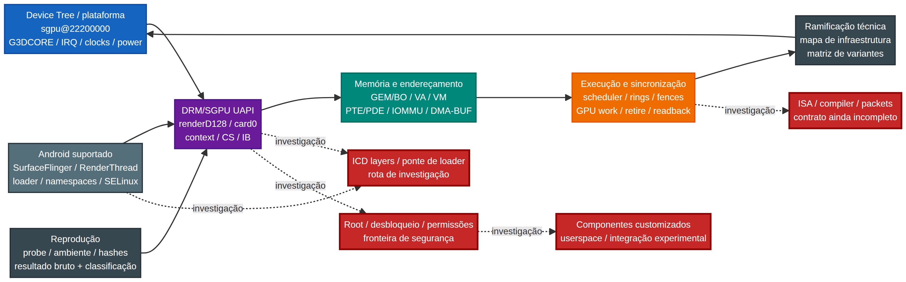

# Mapa e ramificação técnica da Samsung Xclipse 940

**Projeto:** XO940
**Hardware de referência:** Samsung Xclipse 940 — SM-S721B / s5e9945
**Finalidade:** documentar a infraestrutura observada, os caminhos de reprodução e as áreas que exigem investigação adicional.

## Legenda cromática

| Cor | Camada | Uso no mapa |
| --- | --- | --- |
| Azul | Plataforma e Device Tree | `sgpu@22200000`, G3DCORE, clocks, reset, IRQ, DVFS e thermal. |
| Roxo | Kernel, DRM e UAPI | render nodes, GEM/BO, VM, contextos, CS, IB e interfaces de baixo nível. |
| Verde | Memória e endereçamento | VA, PTE/PDE, IOMMU, DMA-BUF, heaps e sincronização de mapeamento. |
| Laranja | Execução GPU | scheduler, rings, command processor, fences, retire e readback. |
| Cinza-azulado | Android e integração | loader, namespaces, SurfaceFlinger, RenderThread, Gralloc e SELinux. |
| Cinza-escuro | Evidência e organização técnica | probes, hashes, mapas, matrizes de variantes e classificação. |
| Vermelho | Caminhos de investigação e possíveis falhas | ICD layers, root, desbloqueio, permissões, componentes customizados, ISA, packets e integração experimental. Vermelho indica risco ou investigação aberta; não indica vulnerabilidade confirmada. |



## Ramificação técnica

```text
SoC Exynos / Android
└── Xclipse 940 / bloco G3D
    ├── Device Tree e plataforma
    │   ├── sgpu@22200000
    │   ├── pd_g3dcore
    │   ├── MMIO: gpu, doorbell, debug, pwrctl, sysreg, htu
    │   ├── IRQ: SGPU e GPU-AFM
    │   ├── clocks, DVFS, IFPO, thermal e reset
    │   └── memória reservada, DMA heap, BTS e SysMMU/IOMMU
    ├── Kernel SGPU / DRM
    │   ├── sgpu_drm.h / UAPI
    │   ├── GEM, BO, TTM e DMA-BUF
    │   ├── VM, PTE, PDE, VA e flush
    │   ├── context, scheduler, prioridade e seqno
    │   ├── CS, chunks, IB e BO_LIST
    │   ├── GFX/COMPUTE, rings e command processor
    │   ├── fences, syncobjs, dependências e retire
    │   └── firmware, timeout, reset e recovery
    ├── Android e integração
    │   ├── libdrm_sgpu.so
    │   ├── vulkan.samsung.so
    │   ├── libOpenCL.so / libSGPUOpenCL.so
    │   ├── SurfaceFlinger / RenderThread / Gralloc
    │   └── linker namespaces, SELinux e HAL
    └── Reprodução e investigação
        ├── probes DRM e inventários runtime
        ├── coleta de ambiente e hashes
        ├── comparação entre variantes Device Tree
        ├── ICD layers e pontes de loader [INVESTIGAÇÃO]
        ├── root, desbloqueio e permissões [INVESTIGAÇÃO]
        ├── componentes customizados de userspace [INVESTIGAÇÃO]
        └── ISA, packets e compiler [INVESTIGAÇÃO]
```

## Caminho operacional observado

```text
Device Tree / power / clocks / reset
        ↓
SGPU kernel driver / DRM UAPI
        ↓
GEM/BO + VM/PTE/PDE + IOMMU
        ↓
context + BO_LIST + CS + IB
        ↓
scheduler + ring + command processor
        ↓
GPU GFX/COMPUTE
        ↓
fence / syncobj / retire
        ↓
readback ou apresentação
```

A cadeia descreve dependências técnicas. Cada etapa permanece classificada individualmente; a presença de uma etapa anterior não prova a conclusão das etapas posteriores.

## Caminhos de investigação em vermelho

Os caminhos vermelhos são pontos que podem determinar a viabilidade de integração de componentes de userspace ou de carregamento alternativo. Eles incluem a relação entre ICD layers e o loader Android, as fronteiras de root e desbloqueio, permissões de `/dev/dri`, namespaces, SELinux, formato de packets, ISA, compiler e sincronização.

O mapa não afirma que qualquer caminho vermelho esteja desbloqueado. O objetivo é indicar onde uma investigação reproduzível deve localizar o contrato ou a falha.

## Proveniência e reprodução

A coleta deve registrar aparelho, build, kernel, firmware, permissões, contexto SELinux, comando, ambiente, saída bruta, resultado e SHA-256. Logs de telefonia, bateria, memória pessoal, caminhos privados e identificadores do usuário devem ser removidos dos derivados públicos. Os arquivos brutos permanecem fora da release.

## Referências internas

- `docs/validation-and-evidence.md`
- `source-analysis/device-tree-technical-map.md`
- `source-analysis/xclipse-2026-09-06-evidence-map.md`
- `STATUS.md`
